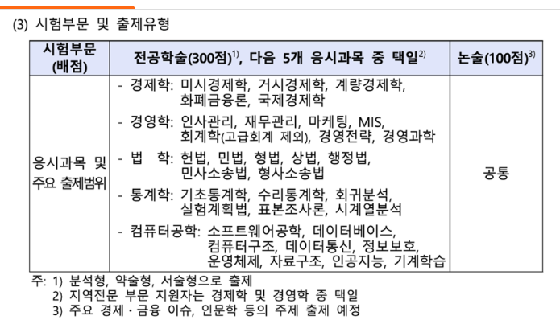

# LLM 기반 제주도 여행 계획 추천 서비스 ‘탐라, 탐나‘

스킬: Spring boot / LangChain / Pinecone / Flask
프로젝트 타입: 교내프로젝트

<aside>
<images src="https://www.notion.so/icons/document_gray.svg" alt="https://www.notion.so/icons/document_gray.svg" width="40px" /> 목차

</aside>

### 프로젝트의 소개

**🍊 LLM 기반 제주도 여행 계획 추천 서비스 "탐라, 탐나"**

- LLM과 RAG를 결하여 제주도를 여행하는 사용자들이 개인의 취향과 필요에 맞춘 여행 계획을 쉽게 세우고 실행할 수 있도록 돕는 플랫폼 개발

---

### 역할 및 기여

- **기획**: 발표 PPT 제작, 보고서 작성, 설계도 및 아키텍쳐 문서화 작업.
- **데이터 수집 및 전처리**: 벡터 DB 구성에 필요한 데이터를 수집하고, 전처리함.
- **벡터 DB 구성**: Pinecone을 이용한 벡터형 데이터베이스를 구성, RAG 기능을 통해 LLM의 답변 성능 향상.
- **백엔드 개발**: 회원 기능을 개발하고 회원 세션 유지 로직 구현을 통해 사용자 경험을 강화.
- **LLM 프롬포터 엔지니어링**: 프롬포터 엔지니어링을 통해서 LLM 모델의 역할 제한 및 답변 성능 강화.

---

### 프로젝트 진행 과정

**개발 범위**

- **플랫폼 기능**:
    - 여행 일정 추천: 사용자 정보를 기반으로 개인화된 여행 일정을 추천.
    - 마이페이지: 사용자가 저장한 일정을 관리.
- **기술 스택**:
    - **프론트엔드**: React를 사용하여 동적인 사용자 경험을 제공.
    - **백엔드**: Spring Boot와 Flask를 이용하여 RESTful API를 구축하고 안정적인 서버 환경을 구현.
    - **데이터베이스**: MySQL과 Pinecone DB를 사용하여 사용자 데이터와 장소 정보를 체계적으로 관리.
    - **LLM 통합**: OpenAI의 GPT를 활용하여 대화형 인터페이스와 로직을 구현.
- 사용 데이터셋
    
    RAG 활용을 위한 데이터셋 구성
    
    - 한국관광공사 관광지 데이터 활용
    - 구글맵 관광지 데이터 크롤링

---

### 최종 결과물

### 개발 내용

회원가입 페이지

로그인 성공 화면

로그인 페이지

- 로그인 및 회원가입 페이지
    - 로그인 기능
        - 사용자가 이메일과 비밀번호를 입력하여 로그인 가능
        - 로그인 성공 시 메인 페이지로 자동 이동
    - 회원가입 기능
        - 새로운 사용자가 이메일과 닉네임 및 비밀번호를 입력하여 계정 생성 가능

메인 페이지

- 메인 페이지
    - 제주도 추천 여행지 영상
        - 메인 페이지에서 제주도의 추천 여행지 영상을 배치하여 사용자 흥미 유발
    - 주요 기능 바로 가기 버튼
        - 마이페이지, 일정 추천, 로그아웃 기능으로 바로 이동할 수 있는 버튼 제공
        - 사용자 편의성을 고려한 직관적인 네비게이션 구성

여행 일정 추천 페이지 - 시작 화면

여행 일정 추천 페이지 - 사용자 초기 입력

여행 일정 추천 페이지 - 일정 생성 중

여행 일정 추천 페이지 - 일정 추천 완료

- 여행 일정 추천 페이지
    - 사용자 초기 입력 기능
        - 사용자가 여행 일정(날짜), 동반자, 테마를 초기 입력값으로 선택 가능
        - 테마는 다중 선택 가능(예: 힐링, 모험, 문화 등)
    - 여행 일정 추천 기능
        - 입력된 초기 데이터를 기반으로 LLM을 활용해 개인화된 여행 일정 추천 제공
        - 사용자는 버튼 클릭으로 간편하게 여행 일정을 추천받을 수 있음

상세 일정 페이지 - 여행 요약

상세 일정 페이지 - 상세 일정

상세 일정 페이지 - 길찾기

상세 일정 페이지 - 경로

- 상세 일정 페이지
    - 상세 여행지 정보 제공
        - 일정에 포함된 여행지에 대해 이미지, 주소, 카테고리(예: 관광지, 음식점 등)와 같은 상세 정보 제공
    - 여행 일정 요약
        - 추천된 일정의 전체 개요를 한눈에 확인할 수 있는 기능 제공
        - 일자별로 여행지와 활동이 정리된 요약 정보 표시
    - 여행 경로 확인
        - 선택된 여행지 간 이동 경로를 카카오 맵을 통해 시각화
        - 이동 수단과 소요 시간을 포함한 상세 경로 제공

여행 일정 추천 페이지 - 수정 요청

여행 일정 추천 페이지 - 수정 완료

- 여행 일정 추천 페이지
    - 추천 일정 수정 요청
        - 대화형 인터페이스를 통해 추천된 일정에 대한 수정 요청 가능
        - 예: 특정 장소 변경, 일정 시간 조정, 추가 장소 요청 등
    - 실시간 반영
        - 사용자가 입력한 수정 요청을 LLM을 통해 즉시 반영하여 수정된 일정 제공
        - 자연어 기반 대화로 직관적인 수정 과정 지원

상세 일정 페이지 - 여행 확정

상세 일정 페이지 - 여행 제목 입력

마이페이지

마이페이지 - 저장한 일정 목록

- 상세 일정 페이지
    - 일정 저장 및 관리
        - 확정된 여행 일정을 저장하여 마이페이지에서 확인 및 관리 가능

- 마이페이지
    - 저장된 일정 목록
        - 사용자가 저장한 여행 일정들을 카드 형태로 볼 수 있음
        - 각 카드에는 여행 일정의 요약 정보(테마, 주요 장소 등)가 표시됨

상세 일정 페이지 - 체크리스트

마이페이지 - 일정 정렬

로그아웃

- 마이페이지
    - 상세 일정 확인
        - 카드를 클릭하면 해당 일정의 상세 일정 페이지로 이동하여 세부 정보 확인 가능
    - 검색 및 정렬 기능
        - 저장된 일정들을 검색하거나 날짜, 테마 등 기준으로 정렬 가능
        - 사용자 편의를 위한 직관적인 필터링 제공
    - 여행 체크리스트
        - 각 일정에 대한 체크리스트 기능 이용 가능
        - 기본 체크리스트 제공 및 사용자 맞춤형 항목 추가/수정 가능
    

### 설계 내용

-  프로젝트 구조도
-  ERD 설계도
-  유저 플로우 차트
-  프론트-백엔드 구조도

---

### 프로젝트를 통해 얻은 인사이트

- **LLM과 RAG 기능의 효과적 연동**: OpenAI의 LLM과 RAG(Retrieval-Augmented Generation) 기능을 연동하여 사용함으로써, 보다 정확한 정보를 제공할 수 있었음. 어떤 데이터를 DB 저장하는 것이 효율적인지 고민하게 되었음
- **Spring Boot를 활용한 백엔드 개발**: Spring Boot를 사용하여 RESTful API를 구축하면서, 백엔드 서비스의 개발과 관리가 더욱 효율적이고 안정적이라는 것을 경험함.
- **랭체인(LangChain) 기능 활용**: LangChain을 통해 자연어 처리의 효율성을 향상시킬 수 있었고, OpenAI의 프롬프터를 조작하여 다양한 기능을 수행하는 에이전트로 설정, 구현하는 경험을 통해 기술적인 이해도가 높아짐.
- **협업 방식에 대한 새로운 이해와 재미**: 다양한 배경을 가진 팀원들과의 협업을 통해 서로 다른 관점과 기술을 합치는 과정에서 많은 것을 배우고 즐길 수 있었음.
- **유지 보수의 중요성 인식**: 프로젝트의 지속적인 개선과 유지 보수 과정에서 발생할 수 있는 다양한 문제에 대처하면서, 유지 보수의 중요성과 이를 위한 체계적인 접근 방법을 깊이 이해하게 되었음. 이는 앞으로의 개발 프로젝트에 있어 유지 보수의 필요성에 대해 고민하게 해줌

---

### Github Link

https://github.com/CSID-DGU/2024-2-SCS4031-jjambbong-3

---